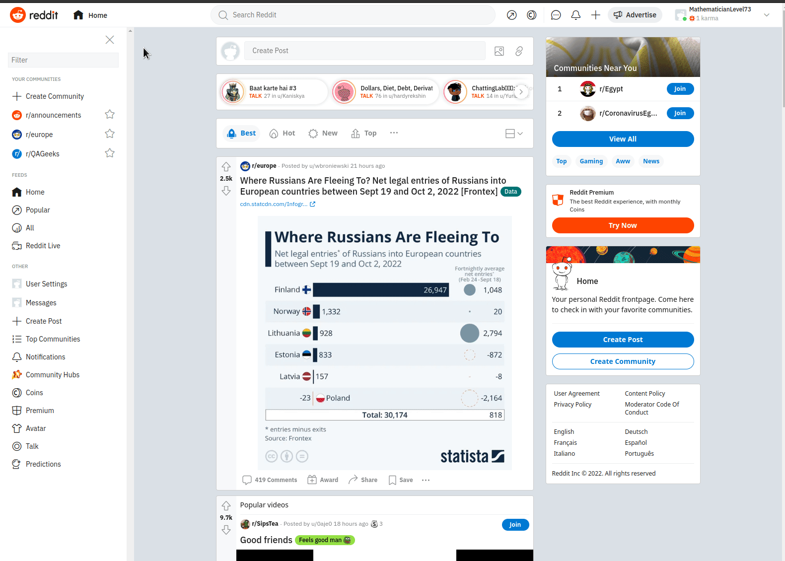
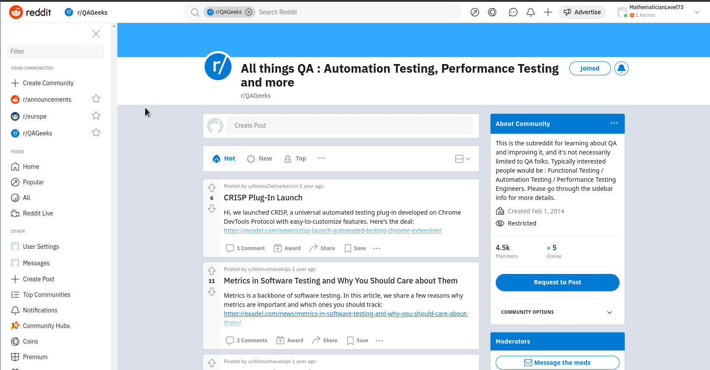
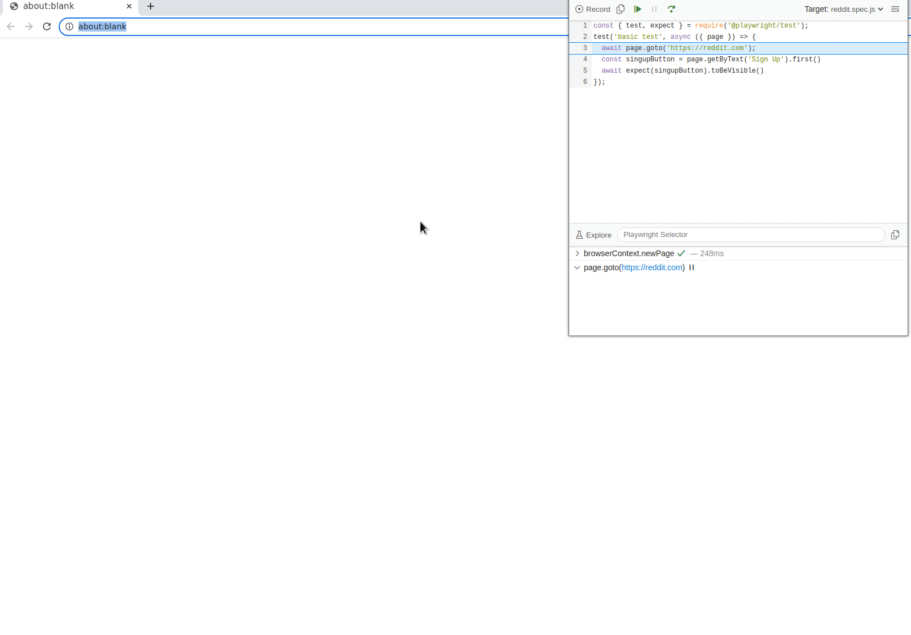

# Introduction

This is the IMPARGO test task for Quality Assurance Engineering and Testing positions.

The largest part of the IMPARGO platform is a web application used by our users in the browser. To ensure high quality during the agile development process and detect regressions quickly we maintain an automated browser testing suite. In this task you should implement similar automated browser tests with [playwright](https://playwright.dev/).


# Tasks
Your task is to implement automated browser tests for the popular site reddit.com. The tests should detect if the described workflow is broken for some reason.

Note, to implement these tests you might need to create a reddit account with a temporary email (e.g. with [temp-mail.org](https://temp-mail.org/en/)).


## Workflow 1: Subscribe to a subreddit
In this workflow a user should be able to visit reddit.com. Choose a subreddit they are interested in (for example [reddit.com/r/QAGeeks/](https://www.reddit.com/r/QAGeeks/)) and subscribe to it. The website persists the subscription status of the subreddit.




## Workflow 2: Create and save a draft post
In this workflow users should be able to create a draft post. Posts are created as part of a subreddit to which they can be then posted later. The website should save the draft posts for later usage. 





## Bonus: Pagespeed report
It is crucial that for the user experience of the user that the main page (reddit.com) loads fast even when a user is logged in. As a bonus task you can try and see if you can add an automatic report to the github action on the repository. The report should warn us if the [pagespeed](https://pagespeed.web.dev/) drops below an unacceptable threshold. 


# Requirement
## Getting started

To implement the tasks you need to have nodejs and yarn installed on your machine. 

By running the following command in the root directory of this repository all dependencies should be installed:

```
yarn install
```

Then you can run the following command to run the browser automation tests. You should see a browser window loading reddit.com after you press the green “play” button.

```
yarn debug
```




## Implementation
Once the setup is complete you can implement your tests in the `./tests` directory. If you are new to playwright checkout [this tutorial](https://playwright.dev/docs/writing-tests) for some basic instruction on how to write tests. 

If you want to give the bonus task a try you can add additional CI workflows in the `.github/workflows` directory. If you are new to github workflows checkout [this resource](https://docs.github.com/en/actions/using-workflows) - it explains the basics well. 


# Notes
* The deadline for the task is 3 days.
* You can check if all your tests pass by running `yarn test`.
* Once you finish the task, you should commit your changes to a separate branch and create a pull request. You can then see via github if the tests or other checks pass or fail and fix them accordingly.